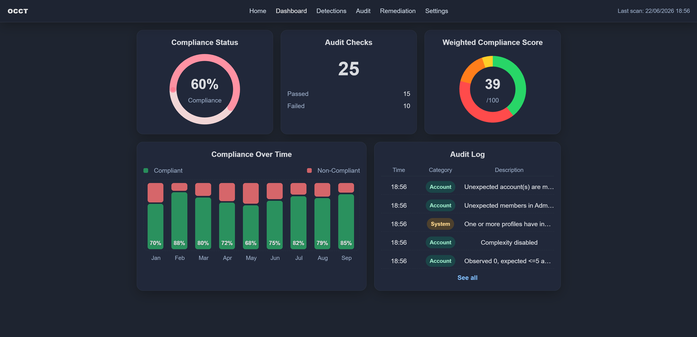
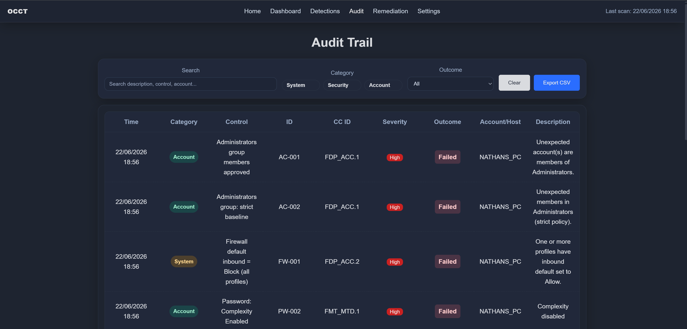
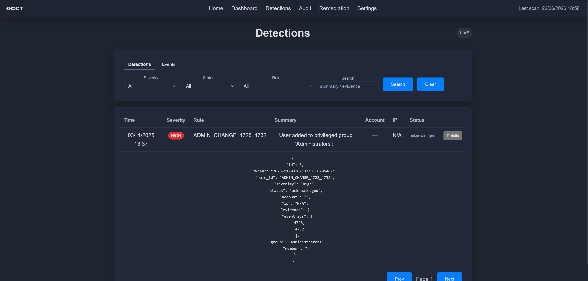
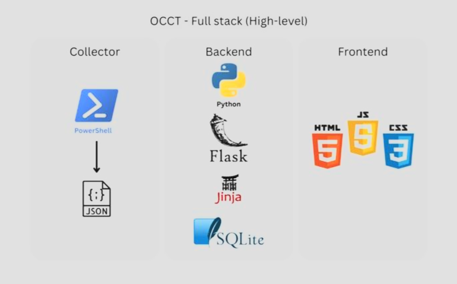
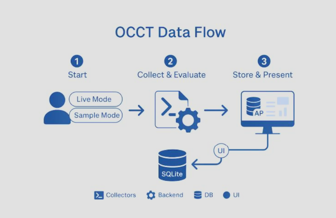

# Windows Compliance Audit Tool — OCCT Case Study

> A Windows security compliance auditing prototype that collects host configuration evidence, maps checks to security controls, and presents results through a web dashboard.

## Overview

OCCT, short for **OS Compliance Check Tool**, was developed as a UTS capstone project to explore how Windows security compliance checks can be automated.

This repository is a **personal portfolio case study** summarising my contribution to the project. The original team repository is available here:

**Original project repository:** [OCCT Capstone Repository](https://github.com/OCCT-Capstone/occt-tool)

The tool collects Windows security configuration evidence using PowerShell collectors, processes and validates the results through a Flask backend, and displays compliance findings through an easy-to-understand web dashboard.

---

## Problem

Manual compliance checks can be slow, inconsistent, and difficult to reproduce. OCCT was designed to make endpoint compliance review more structured, simple, and integrated by collecting evidence directly from Windows systems, including logs and controls, to present the results in a clear dashboard.

The project focused on turning raw system configuration data into useful multi-faced audit evidence against the Common Criteria.

---

## My Role

My main contribution was as the backend developer and team lead for OCCT.

I was responsible for building the backend logic that connected the PowerShell-based Windows collectors to the web application. This included handling scanner execution, evidence ingestion, validation logic, database operations, API endpoints, live polling, result normalisation, and the core functionality required for the dashboard to display compliance results.

While the project was completed as a team, I worked across multiple parts of the application to bring the system together, including backend development, PowerShell integration, frontend support, debugging, and end-to-end testing.

My responsibilities included:

- Designing and implementing the Flask backend structure
- Building API routes for scan execution, results, evidence, remediation, and dashboard data
- Integrating PowerShell collectors into the backend workflow
- Normalising collector output into a consistent JSON format
- Implementing YAML-driven validation logic for compliance checks
- Managing database models, storage, and result retrieval using SQLite and SQLAlchemy
- Supporting live polling so scan progress and results could update through the web interface
- Adapting PowerShell collector output to fit the backend ingestion format
- Connecting backend data to frontend dashboard, audit, and remediation views
- Debugging issues across the backend, frontend, and collector integration flow
- Supporting overall project coordination as team lead

---

## Key Features

- PowerShell-based Windows audit collectors
- JSON-formatted evidence output
- Flask backend
- SQLite database storage
- Web dashboard for viewing audit results
- YAML-based compliance check definitions
- Sample mode for demonstration without live collection
- Evidence-focused audit and remediation views

---

## Example Checks

| Control Area | Example Check | Evidence Source |
|---|---|---|
| Password Policy | Minimum password length | Local Security Policy / `secedit` |
| Password Policy | Password complexity enabled | Local Security Policy / `secedit` |
| Account Lockout | Lockout threshold configured | Local Security Policy / `secedit` |
| Audit Evidence | Security-related event visibility | Windows Event Logs |
| Privileged Access | Local administrator visibility | Windows account/group configuration |

One of our key checks assessed whether a Windows host had appropriate password and lockout policy settings, including:

- Minimum password length of at least 14 characters
- Password complexity enabled
- Account lockout threshold configured
- Lockout threshold not set to an unsafe value

 | 

---

## Architecture

 | 

---

## Technology Stack

| Area | Technologies |
|---|---|
| Scripting | PowerShell |
| Backend | Python, Flask |
| Database | SQLite, SQLAlchemy |
| Frontend | HTML, CSS, JavaScript, Chart.js |
| Data Format | JSON, YAML |
| Target Platform | Windows 11 |

---

## Security Relevance

This project demonstrates skills relevant to security analyst, GRC, SOC, and security engineering roles:

- Backend development for security tooling
- Windows security policy auditing
- PowerShell collector integration
- Compliance evidence collection and normalisation
- YAML-driven validation logic
- API and database design for audit results
- Security control mapping
- Translating raw system evidence into dashboard-ready findings
- Debugging and integrating a multi-component security application

---

## What I Learned

This project helped me understand how to communicate technical concepts clearly to industry professionals to consult and maintain development with respect to the client's requirements and scope.

Key takeaways:

- Compliance findings need clear evidence, not just pass/fail labels
- PowerShell is effective for Windows security auditing when output is structured properly
- Security dashboards need to simplify findings without hiding technical context
- Audit tools need reliable evidence sources and repeatable logic
- Technical checks become more valuable when mapped to security or compliance requirements

---

## Limitations

OCCT was developed as a capstone prototype, not a production enterprise platform.

Current limitations include:

- Limited operating system scope
- Limited control coverage
- Prototype-level access control
- Local database design
- Limited automated remediation
- Limited testing across large environments

---

## Future Improvements

If continued, the project could be improved by adding:

- More Windows security checks
- Scheduled scans
- Role-based access control
- Improved remediation guidance, including automation
- Stronger error handling in collectors
- Broader compliance framework mapping
- AI integration and automation
- Email or SIEM integration

---

## Related Repository

This case study is based on the original OCCT team project:

[https://github.com/OCCT-Capstone/occt-tool](https://github.com/OCCT-Capstone/occt-tool)

---

## Disclaimer

This repository is a personal portfolio case study for a university capstone project. The original project was completed as part of a team. This page focuses on my contribution, the project’s security relevance, and what I learned from the implementation.
